# Laporan_Praktikum_Web2

# Portal Berita - CodeIgniter 4 & Vue JS

## Deskripsi Project

Portal Berita merupakan aplikasi berbasis web yang dibuat menggunakan **CodeIgniter 4 sebagai Backend REST API** dan **Vue JS sebagai Frontend**.

Aplikasi ini memiliki fitur pengelolaan artikel (CRUD), autentikasi login, komunikasi API menggunakan Axios, serta integrasi database MySQL.

Project ini dibuat untuk implementasi pembelajaran pengembangan aplikasi web modern dengan konsep pemisahan Backend dan Frontend.

---

# Teknologi yang Digunakan

## Backend
- CodeIgniter 4
- PHP 8
- MySQL
- REST API
- JWT/Token Authentication sederhana
- Postman untuk testing API

## Frontend
- Vue JS 3
- Vite
- Axios
- Vue Router
- CSS

---

# Fitur Aplikasi

## Backend CodeIgniter

### 1. Halaman Website

Tersedia halaman:

- Home
- Artikel
- Tentang Saya
- Kontak

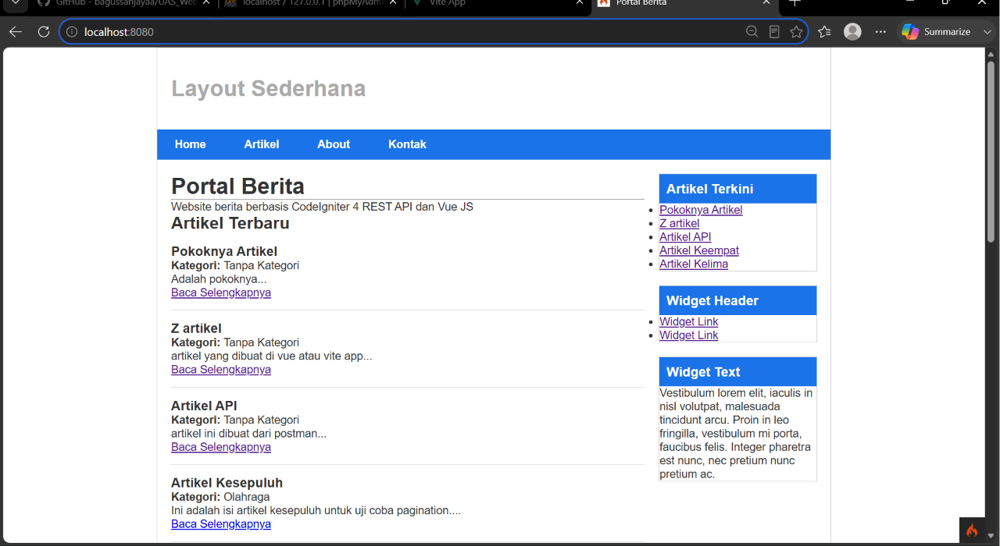

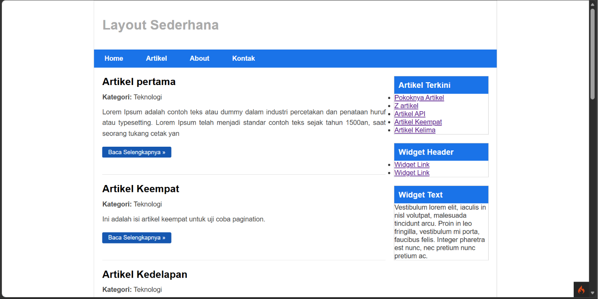

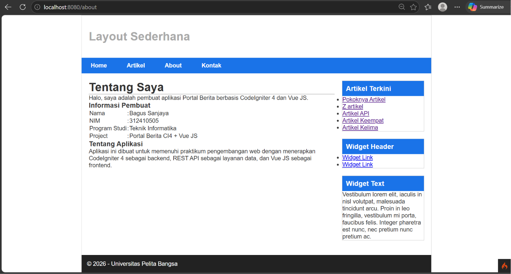

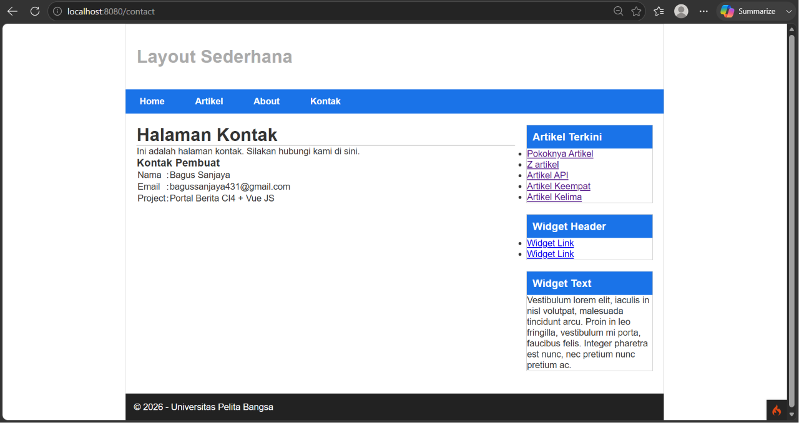

### Tampilan Backend

Home Backend:

```

Portal Berita

Website berita berbasis CodeIgniter 4 REST API dan Vue JS

Artikel Terbaru

* Artikel API
* Artikel Kesebelas
* Artikel lainnya

```


Artikel Backend:

```

Daftar Artikel

Judul Artikel
Kategori
Isi Artikel

Baca Selengkapnya

```


---

# 2. Manajemen Artikel

Admin dapat melakukan:

- Menampilkan artikel
- Menambah artikel
- Mengubah artikel
- Menghapus artikel

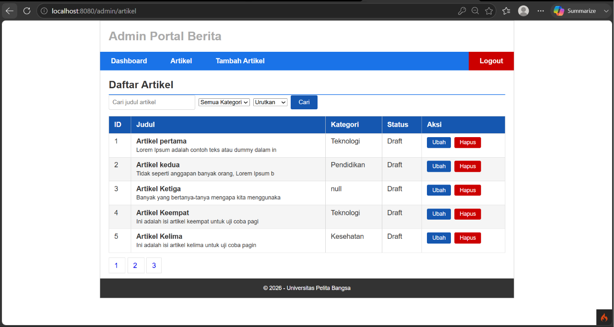

Database artikel:

```

id
judul
isi
gambar
status
slug
created_at
id_kategori

```

---

# 3. REST API

Endpoint API:

## GET Semua Artikel

```

GET

http://localhost:8080/post

````

Response:

```json
{
 "artikel":[
   {
    "id":"1",
    "judul":"Artikel pertama",
    "isi":"..."
   }
 ]
}
````

---

## POST Tambah Artikel

```
POST

http://localhost:8080/post
```

Data:

```json
{
 "judul":"Artikel Baru",
 "isi":"Isi artikel"
}
```

---

## PUT Update Artikel

```
PUT

http://localhost:8080/post/{id}
```

---

## DELETE Artikel

```
DELETE

http://localhost:8080/post/{id}
```

---

# 4. Login API

Endpoint:

```
POST

http://localhost:8080/api/login
```

Request:

```json
{
"useremail":"admin@gmail.com",
"userpassword":"password"
}
```

Response:

```json
{
"status":200,
"message":"Login Berhasil",
"data":{
 "token":"TOKEN"
}
}
```

---

# Tampilan Frontend Vue JS

## Login Page

Fitur:

* Login menggunakan email
* Menyimpan token
* Masuk ke aplikasi setelah berhasil login

Tampilan:

```
----------------------

Login

Email

Password


[ Login ]

----------------------

```
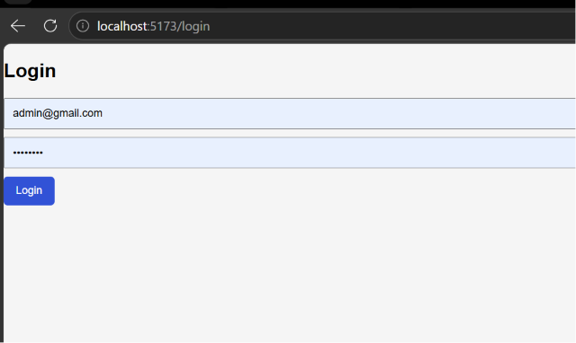

---

# Dashboard Artikel Vue

Frontend memiliki fitur:

* Menampilkan artikel dari API
* Tambah artikel
* Edit artikel
* Hapus artikel

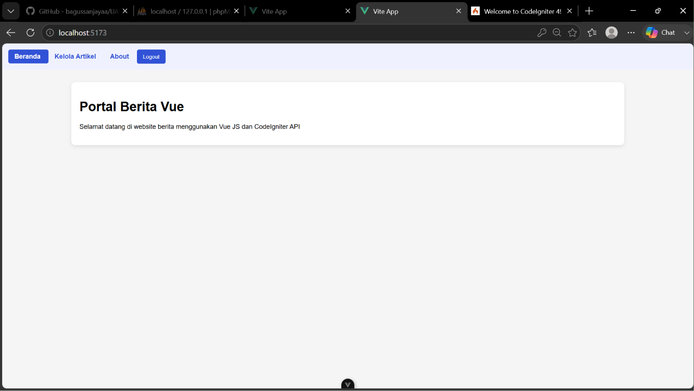

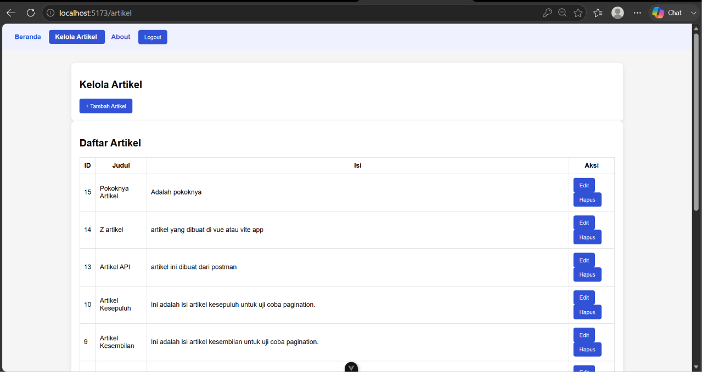

Tampilan:

```
Kelola Artikel


[ + Tambah Artikel ]


Daftar Artikel

ID | Judul | Isi | Aksi

1  | Artikel API | .... | Edit Hapus

```

---

# Tambah Artikel

Form hanya muncul ketika tombol tambah ditekan.

Tampilan:

```
Tambah Artikel


Judul Artikel

Isi Artikel


[ Simpan ]

[ Batal ]

```

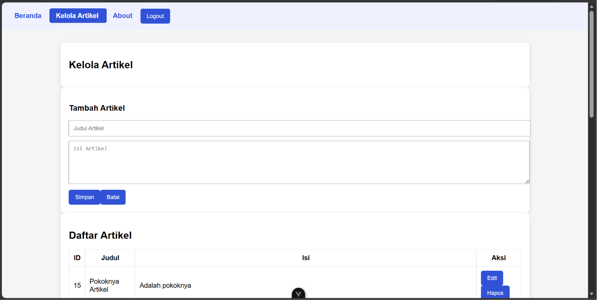

---

# Edit Artikel

Data artikel dapat diubah:

```
Edit Artikel


Judul Lama

Isi Lama


[ Update ]

```

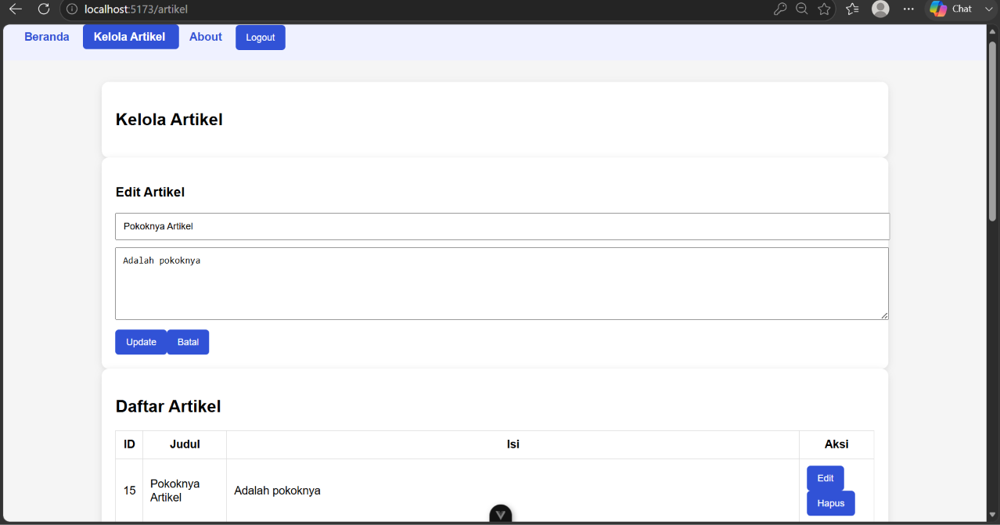

---

# Hapus Artikel

Menghapus data menggunakan API:

```
DELETE /post/{id}
```

---

# Navigasi Frontend

Navbar:

```
Beranda
|
Kelola Artikel
|
Tentang Saya
|
Logout
```

---

# Tentang Saya

Berisi informasi pembuat aplikasi:

```
Nama      : Bagus Sanjaya

NIM       : 312410505

Project   : Portal Berita CI4 + Vue JS

```

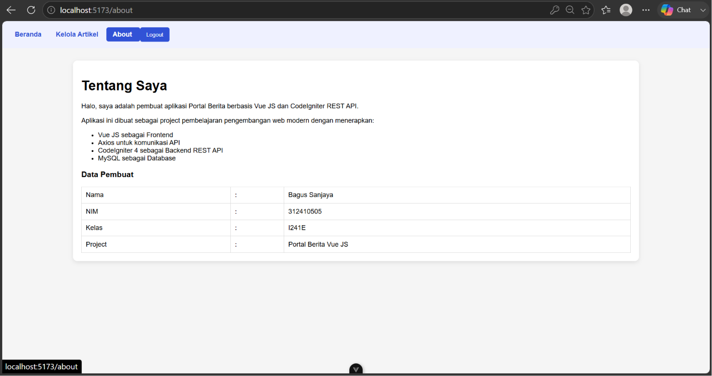

---

# Cara Menjalankan Project

## Backend

Masuk folder backend:

```
cd backend
```

Install dependency:

```
composer install
```

Jalankan:

```
php spark serve
```

Backend berjalan:

```
http://localhost:8080
```

---

## Frontend

Masuk folder frontend:

```
cd frontend
```

Install package:

```
npm install
```

Jalankan:

```
npm run dev
```

Frontend berjalan:

```
http://localhost:5173
```

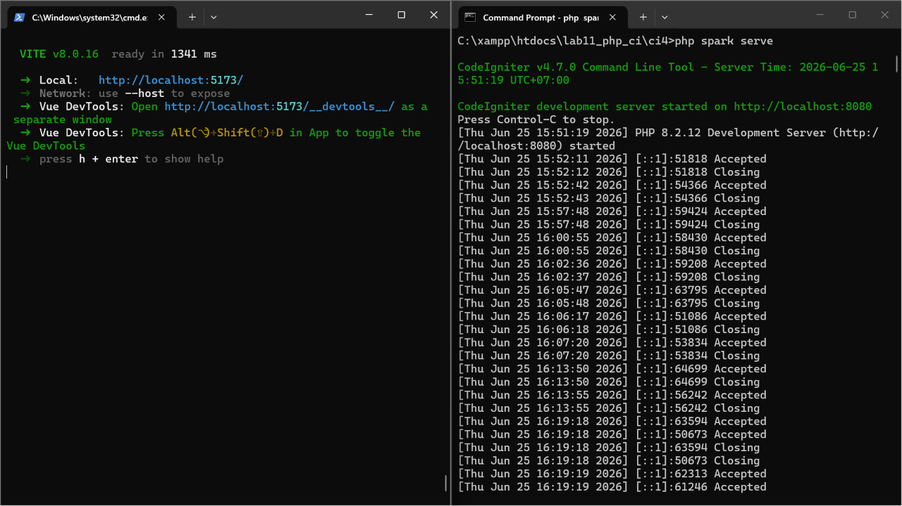

---

# Database

Buat database MySQL:

```
portal_berita
```

Import tabel:

* user
* artikel
* kategori

---

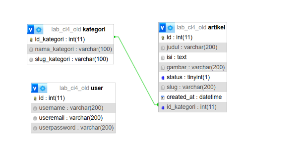

# Kesimpulan

Project Portal Berita berhasil dibuat dengan konsep pemisahan Backend dan Frontend.

CodeIgniter 4 digunakan sebagai REST API dan pengelola database, sedangkan Vue JS digunakan sebagai antarmuka pengguna yang melakukan komunikasi data menggunakan Axios.

Aplikasi berhasil menerapkan:

* CRUD Artikel
* Login Authentication
* REST API
* Vue Router
* Axios
* Database MySQL
